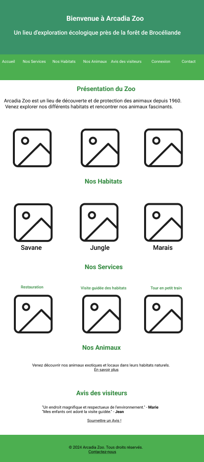
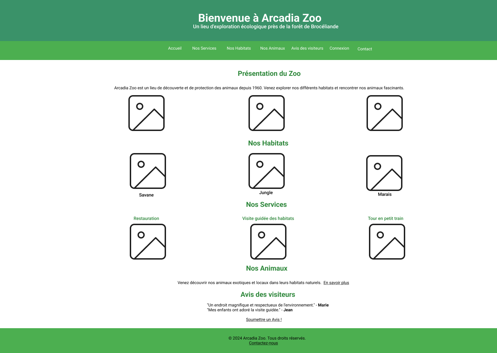
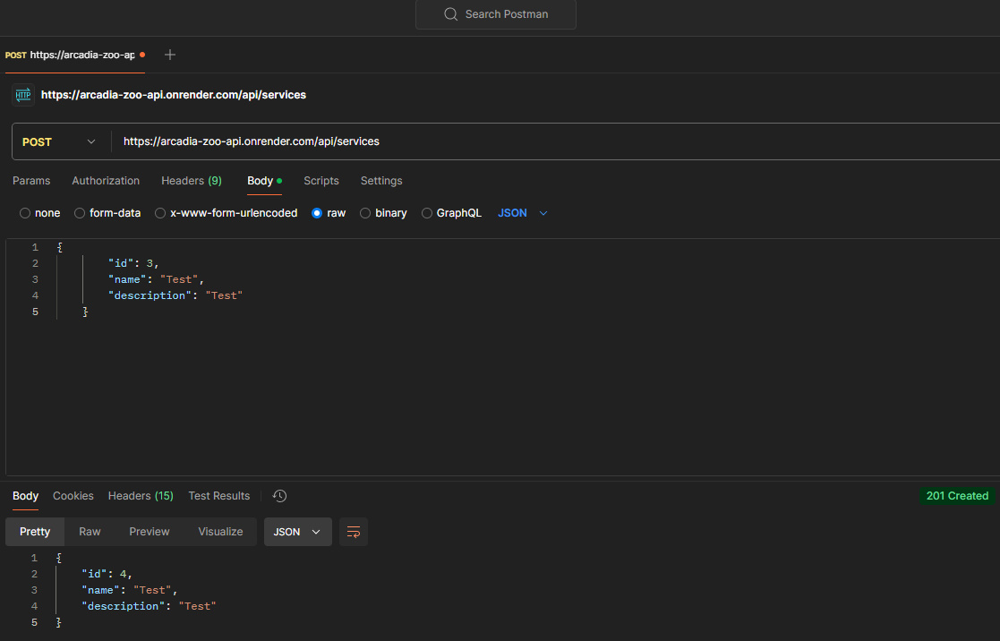
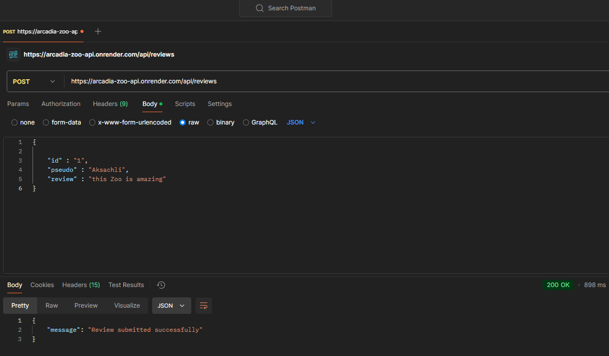
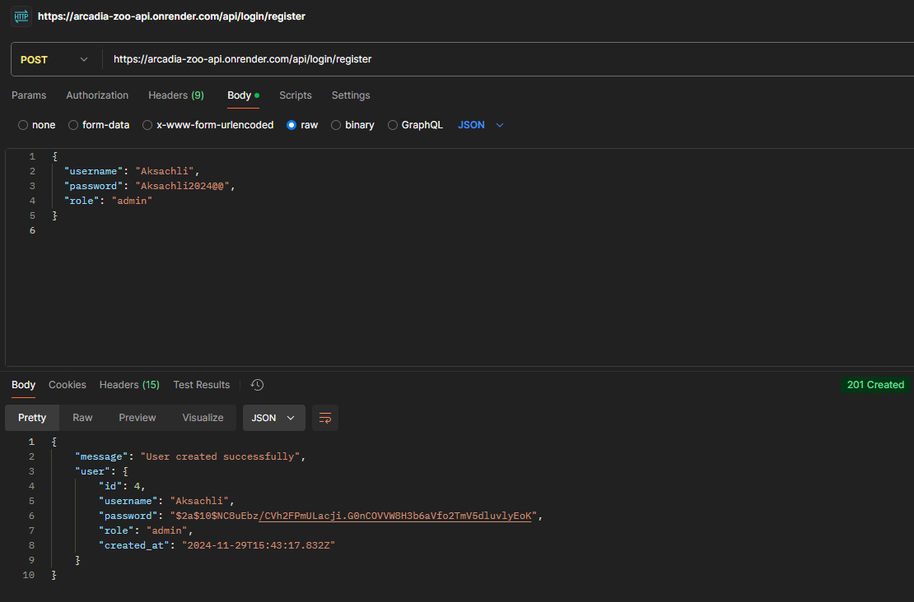
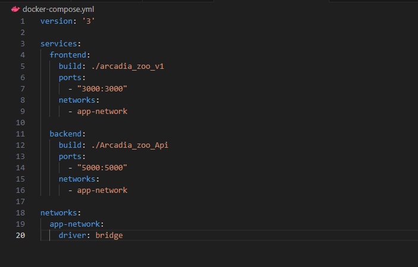

# Arcadia Zoo Projet

"Welcome to the Arcadia Zoo repository! This project showcases my expertise in HTML, CSS, JavaScript, Node.js, and database management with PostgreSQL and MongoDB.

The application is designed to provide a seamless user experience, enabling users to explore animal habitats, submit reviews, and learn about services while offering administrators tools to manage the zoo effectively."

### Technologies Used

#### Front-End

1. HTML, CSS, JavaScript for creating a responsive and interactive interface.
2. Deployment: Hosted on Render.

#### Back-End

1. Node.js & Express.js for API development.
2. PostgreSQL for relational data (e.g., users, reviews).
3. MongoDB for non-relational data (e.g., animals).
4. Authentication: Implemented using bcrypt for password hashing.
5. Deployment: Render for API hosting.

### Features

#### User-Facing Features

1. User Authentication: Secure registration and login functionality.
2. Review System: Submit, view, and manage reviews for animals and services.
3. Responsive Design: Optimized for desktop and mobile devices.

   
   

#### Admin Features

1. Admin Panel: Manage users, animals, and reviews.
2. Service Management: Add or update zoo services dynamically.

### Setup Instructions

#### Clone the Repositories

1. Clone the front-end repository:
 ```javascript
 git clone https://github.com/Aksachlisimo/arcadia_zoo_v1.git
```
2. Clone the back-end repository:
     ```javascript
 git clone https://github.com/Aksachlisimo/Arcadia_zoo_Api.git
     ```

#### Run Locally

1. Navigate to the front-end directory and open the `index.html` file in your web browser: `cd arcadia_zoo_v1`
2. Follow the instructions in the back-end README for API setup.

### Explore the Project

#### Deployed Links:

- Front-End: Live on Render
- Back-End: API Endpoints

### Database Schema (PostgreSQL & MongoDB):

Here is an example of a MongoDB schema used to store animal data:

```javascript
const animalSchema = new mongoose.Schema({
  name: { type: String, required: true },
  description: { type: String, required: true },
  imageUrl: { type: String, required: true },
  views: { type: Number, default: 0 }
});
```


### API Endpoints :





### Docker Setup
To run both the front-end and back-end using Docker, here are the necessary configurations:

#### Dockerfile for Front-End :

```javascript
FROM node:14

WORKDIR /app

COPY . .

RUN npm install

CMD ["npm", "start"]

```

#### Dockerfile for Back-End :

```javascript

FROM node:14

WORKDIR /app

COPY . .

RUN npm install

CMD ["npm", "start"]
```

#### docker-compose.yml:

To run both services together, here is the docker-compose.yml file :




### Contributing

#### Steps to Contribute
1. Fork the repository.
2. Create a feature branch :
 ```javascript
    git checkout -b feature-name
   ```
3. Commit your changes :
   ```javascript
   git commit -m "Add feature"
    ```
4. Push to the branch :
 ```javascript
   git push origin feature-name
```
7. Create a pull request.

## Contact :
 Have questions or suggestions? Feel free to reach out to us at mohamedmouhimine@gmail.com


## Contact :
Have questions or suggestions? Feel free to reach out to us at mohamedmouhimine@gmail.com
